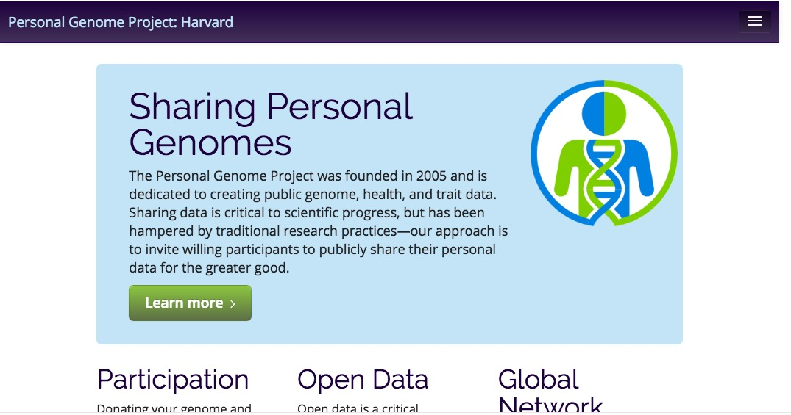

## About

- Associate Professor of Psychology
- Founding Director of Human Imaging at [SLEIC](http://imaging.psu.edu)
- Co-founder and Co-Director of the [Databrary.org](http://databrary.org) digital library
- A.B., Cognitive Science, Brown; M.S. & Ph.D., Cognitive Neuroscience, Carnegie Mellon University.
- Folk music, theatre, cycling, hiking, paddling, amateur radio (K3ROG)

## Overview

- Why behavioral science is harder than physics
- Why behavioral science must embrace big(ger) data
- Challenges with big data behavioral science
- Some solutions
- Let's boldly go

## Why psychology is harder than physics {.flexbox .vcenter}

## Why psychology is harder than physics {.flexbox .vcenter}

## Behavioral science must embrace big(ger) data

## Space x time x person

## People

- Have families
- Live in neighborhoods, cities/towns, regions, countries
- Go to schools, jobs, houses of worship
- Are richer or poorer than their neighbors

----

[[@sejnowski_putting_2014]](http://doi.org/10.1038/nn.383)

----

----

----

----

<iframe width="560" height="315" src="https://www.youtube.com/embed/Qj2uWpYsdcM" frameborder="0" allowfullscreen></iframe>

----

<iframe width="560" height="315" src="https://www.youtube.com/embed/DafZSeIGLNE" frameborder="0" allowfullscreen></iframe>

Example of [study](http://news.stanford.edu/2016/08/18/combining-satellite-data-machine-learning-to-map-poverty/) from Stanford using machine learning to predict poverty.

----

[[@jean_combining_2016]](http://doi.org/10.1126/science.aaf7894)

## Poverty shrinks brains

[[@reardon_poverty_2015]](http://doi.org/10.1038/nature.2015.17227), [[@noble_family_2015]](http://doi.org/10.1038/nn.3983)

## Overview

- ~~Why behavioral science is harder than physics~~
- ~~Why behavioral science must embrace big(ger) data~~
- Challenges with big data behavioral science
- Some solutions
- Let's boldly go

## Challenges with big data behavioral science

- Must gggregate, link data across **space**, **time**, **individual identities**
- Data not spatially uniform
- Time series not uniformly sampled, different sampling intervals

----

The data cube has holes. Big ones.

## Challenges with big data behavioral science

- Aggregating big data about individuals poses privacy risks

----

## Insight and opportunity?

- (Many) people will volunteer personal data if given something of value in return
- What value can *researchers* offer?

----

----

----

## Challenges with big data behavioral science

- Behavior rich, complex
- Many important behaviors go unmeasured
    - What did you have for breakfast this morning?
    - Last Thursday?

## Challenges with big data behavioral science

- Word and numeric measures don't fully capture phenomena

----

<iframe src="https://autismandbeyond.researchkit.duke.edu/"></iframe>

----

[[@deloache_scale_2004]](http://doi.org/10.1126/science.1093567)

----

<video width="640" height="480" controls>
  <source src="https://nyu.databrary.org/slot/9850/-/asset/11550/download?inline=true" type="video/mp4">
Your browser does not support the video tag.
</video>
[[@b03c5c6c-31b8-445e-9e4f-8917b735bb53]](http://doi.org/10.17910/B7H019)

----

<video width="640" height="480" controls>
  <source src="https://nyu.databrary.org/slot/11647/0,84928/asset/40653/download?inline=true" type="video/mp4">
Your browser does not support the video tag.
</video>
[[@b155b094-099c-4015-8d05-143257d99f28]](http://doi.org/10.17910/B7.236)

- Here's another example from Chen Yu and Linda Smith.
- It shows the results from two, temporally synched head-mounted eye trackers worn by a mother and her infant while the two play with a set of toys.
- Do infants look at the toys when their mothers direct them to? Do infants look at toys when moms speak?
- Might this form of "joint attention" be a mechanism for language learning?

----

<iframe src="http://pediatrics.aappublications.org/content/early/2016/08/11/peds.2016-1533" width=750px height=500px>
</iframe>

[[@batra_nocturnal_2016]](http://doi.org/10.1542/peds.2016-1533)

----

<video width="640" height="480" controls>
  <source src="https://nyu.databrary.org/slot/11141/0,5000/asset/37958/download?inline=true" type="video/mp4">
Your browser does not support the video tag.
</video>

[[@6243604f-bfd6-488f-b744-50305e9eefaa]](http://doi.org/10.17910/B7G59R)

----

<video width="640" height="480" controls>
  <source src="https://nyu.databrary.org/slot/11141/0,5000/asset/37962/download?inline=true" type="video/mp4">
Your browser does not support the video tag.
</video>

[[@6243604f-bfd6-488f-b744-50305e9eefaa]](http://doi.org/10.17910/B7G59R)

----

<video width="640" height="480" controls>
  <source src="https://nyu.databrary.org/slot/11141/0,5000/asset/37968/download?inline=true" type="video/mp4">
Your browser does not support the video tag.
</video>

[[@6243604f-bfd6-488f-b744-50305e9eefaa]](http://doi.org/10.17910/B7G59R)

----

<iframe src="http://databrary.org" width=640px height=400px>
</iframe>

## [Databrary.org](http://databrary.org)

- Digital data library specialized for research video
- Video/audio + participant/context metadata
- Share displays, materials, text-based data files
- Policy framework for sharing identifiable data
- Developmental focus, but not exclusive

## [Databrary.org](http://databrary.org) facilitates data sharing, re-use, preservation

- High capacity, centralized storage
- Transcoding to common, interoperable formats
- Long-term preservation

## Databrary helps to overcomes barriers to sharing video

- Policies for sharing identifiable video data
- Tools for reproducibly coding video
- Tools for "active curation" == during data collection
- Tools for searching, filtering

## Policies

- Restrict access to authorized researchers (& affiliates)
    + PIs and the trainees they supervise
    + Institutional [access agreement](https://databrary.org/access/policies/agreement.html)
- Seek permission to share data from participants
    + Release [template](https://databrary.org/access/policies/release-template.html); [script](https://databrary.org/access/guide/investigators/release/asking/script.html); sample [video](https://databrary.org/video/example-video-1.mp4)

## Standardized (reproducible) release levels

## Tools for coding video

- Raw research video must be coded by human observers
- [Datavyu](http://datavyu.org) a free, [open source](https://github.com/databrary/datavyu) coding tool
- Add codes, annotations time-locked to video segments
- Turn behavior into quantifiable data
- Ruby API for [scripting](https://github.com/databrary/Datavyu-Example-Scripts) reproducible workflows

----

---- 

<video width="700" height="550" controls>
  <source src="https://nyu.databrary.org/slot/11652/307774,376273/asset/47075/download?inline=true" type="video/mp4">
Your browser does not support the video tag.
</video>

</iframe>

- Here's an example of a short segment of video that has been coded for a some behaviors of interest -- speech, actions involving objects, and locomotion.
- Notice how the annotations, coupled to the video segments, reveals the complex interrelationships among behaviors.
- And, we've only focused on a subset of them.

## What can we learn from large-scale video data sharing?

- Jayaraman, S., Smith, L.B., Raudies, F. & Gilmore, R.O. (2014). Natural Scene Statistics of Visual Experience Across Development and Culture. Databrary. Retrieved September 1, 2016 from <http://doi.org/10.17910/B7988V>.

## Toward a big data behavioral science

- Data sharing in open (to scientists) repositories
- Video and other spatially & temporally dense streams essential
    + Video captures behavior
    + Video improves methodological transparency

## Toward a big data behavioral science

- Linking data across time, space, individuals
- Framework for securing participant permission, limiting access
- Statistical techniques that yield discoveries

## What's Donald Rumsfeld have to do with this?

## The Rumsfeldian view of the world

|                     | Knowledge      | No knowledge     |
|---------------------|----------------|------------------|
| Memory/awareness    | Known-knowns   | Known-unknowns   |
| No memory/awareness | Unknown-knowns | Unknown-unknowns |

## Where we spend most of our time...

- Confirming known-knowns >>
- Testing known-unknowns >>
- Considering unknown-knowns

----

## Imagine a databservatory...

## Starting with *our* university community

## Starting with *our* university community

----

- App, web-framework, data-collection tool + repository + analysis platform
- [Open Humans Project](https://www.openhumans.org/) + [DataWallet](https://datawallet.io/) + [MechanicalTurk](https://www.mturk.com) + [ResearchKit](http://www.apple.com/researchkit/)/[Open Data Kit](https://opendatakit.org/)
- Link researchers with participants
- Securely store, manage, share data
- Participants get their own results + compare to others

## Acknowledgments

- [NSF BCS-1238599](http://www.nsf.gov/awardsearch/showAward?AWD_ID=1238599&HistoricalAwards=false)
- [NICHD U01-HD-076595](https://projectreporter.nih.gov/project_info_description.cfm?aid=8531595&icde=15908155&ddparam=&ddvalue=&ddsub=&cr=1&csb=default&cs=ASC)
- [Society for Research in Child Development (SRCD)](http://srcd.org)
- NYU Libraries, NYU IT, IRB, and OSP

## Stay in touch

- rogilmore@psu.edu
- [github.com/gilmore-lab](http://github.com/gilmore-lab)
- [gilmore-lab.github.io](http://gilmore-lab.github.io)

## References {.smaller}

